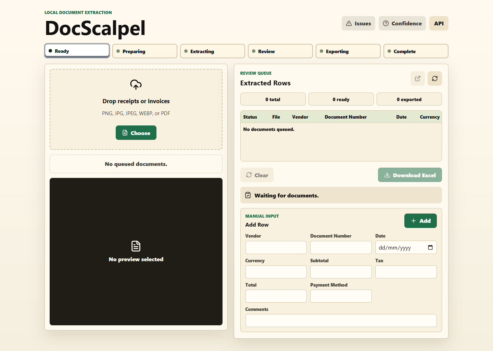
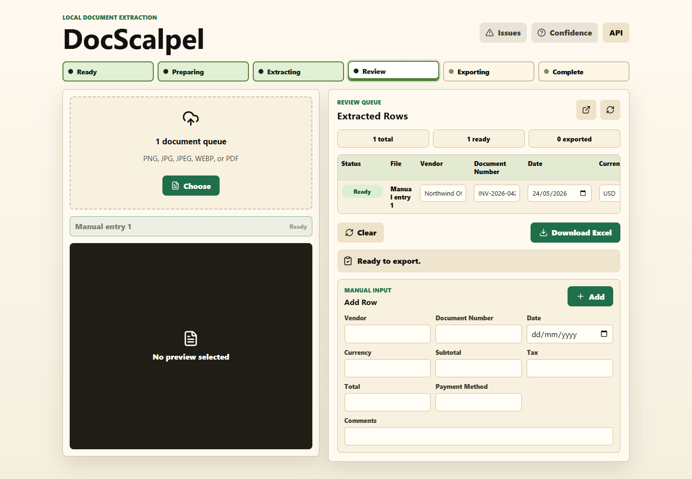
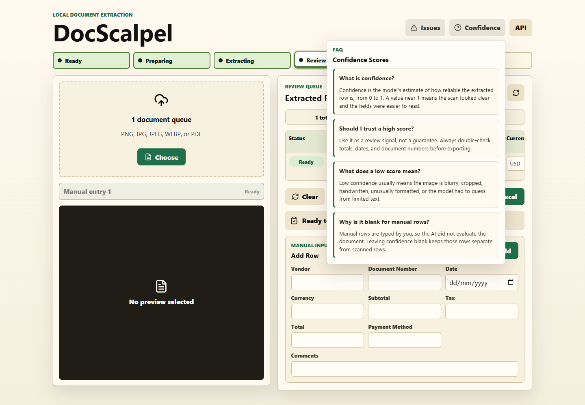
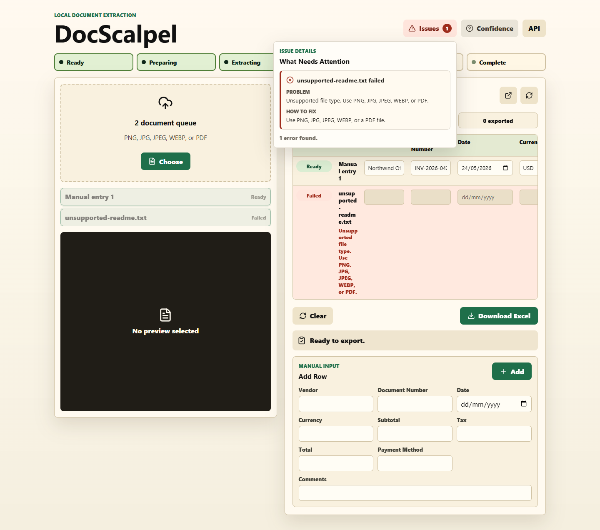

# DocScalpel

DocScalpel is a local-first document extraction app for receipts and invoices. It helps you upload scanned documents, extract key fields with OpenAI vision, review and edit the results, then export a clean Excel workbook.

The browser app handles uploads, PDF/image preparation, bulk review, manual entries, inline edits, issue guidance, and Excel export. A small local Node API keeps your OpenAI API key out of the browser and performs the extraction request.

DocScalpel runs on your PC. OpenAI extraction still requires internet access.



## Features

- Bulk upload for PNG, JPG, JPEG, WEBP, and PDF documents.
- Sequential extraction so one failed document does not stop the rest of the batch.
- Client-side PDF/image preparation before extraction.
- Editable review queue for vendor, document number, date, currency, subtotal, tax, total, payment method, confidence, and comments.
- Manual row entry for documents you want to type in yourself.
- Excel export with one header row and one row per ready document.
- Top-right issue helper with Problem and How to fix guidance.
- Confidence FAQ that explains what the AI confidence score means.

## Review Queue

After extraction, each document appears as an editable row. You can correct fields before downloading the Excel workbook. Manual rows are supported too, and their confidence value stays blank because the AI did not evaluate those entries.



## Confidence FAQ

The Confidence menu explains how to read the model's confidence score. Treat confidence as a review signal, not a guarantee. Low confidence usually means the scan was blurry, cropped, handwritten, or unusually formatted.



## Issue Helper

The Issues menu stays out of the way until something needs attention. It groups errors and warnings in the top right and gives a short fix for each problem.



## Setup

```powershell
npm.cmd install
Copy-Item .env.example .env
```

Edit `.env` and add your OpenAI API key:

```text
OPENAI_API_KEY=sk-your-openai-api-key
OPENAI_MODEL=gpt-4o-mini
LOCAL_API_PORT=8787
```

## Run

```powershell
npm.cmd run dev
```

Open:

```text
http://127.0.0.1:5173
```

The local API runs at:

```text
GET http://127.0.0.1:8787/api/health
POST http://127.0.0.1:8787/api/document-extract
```

## Bulk Upload Flow

1. Select or drop one or more supported document files.
2. DocScalpel prepares each file in the browser.
3. The local API sends the prepared image to OpenAI for extraction.
4. Each successful result appears in the review queue.
5. Failed documents remain visible with a fix suggestion in the Issues menu.
6. Edit rows as needed.
7. Download one Excel workbook containing the ready rows.

Multi-page PDFs currently process page 1 only.

## Test Fixtures

Synthetic fixtures are included under `fixtures/`:

- `sample-receipt.png`
- `sample-invoice.png`

These are generated examples and do not contain private or real business data.

## Build

```powershell
npm.cmd run build
```
